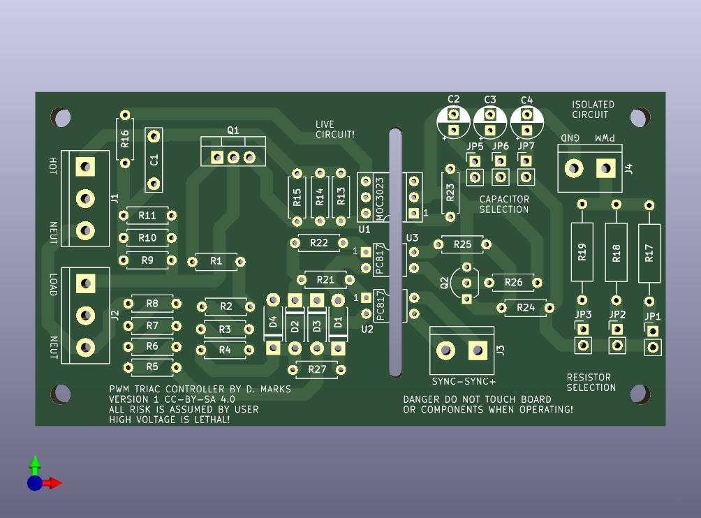

# TriacControl

This is an optoisolated triac motor speed controller where the phase control of the motor AC signal may be controlled by an analog or PWM signal.
Typically, a universal motor tool such as a drill or a router could have it's speed varied this way.
A PWM signal would usually be supplied by a microcontroller.  This motor speed control is open-loop and you have to add a tachometer
if you want to be able to vary the motor speed to achieve a particular rotation rate.

The voltage for the control may be 3.3 v, 5v, or up to 24 v.  A resistor (one of R17,R18,R19) and a capacitor (one of C2,C3,C4) determine how
the voltage/PWM signal varies the motor speed control.  The minimum control voltage to turn on the triac is about 1.75 V.  3.3V control uses
a 100 ohm resistor and a 22 uF capacitor, a 5 V control uses a 470 ohm resistor and a 47 uF capacitor, 12 volts uses a 2k2 resistor and 47 uF
capacitor, and 24 V uses a 4k7 resistor an 47 uF capacitor.  You may have to experiment to get it to put the control voltage into the required
range.  If you have an incandescent light bulb, you can use that as the load rather than the motor to see how bright it gets as you vary the
control voltage.  Three resistors and three capacitors may be placed on the board and selected using jumpers so that soldering need not be performed
to try different values.

